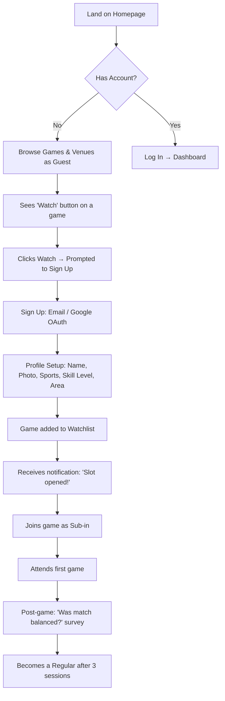
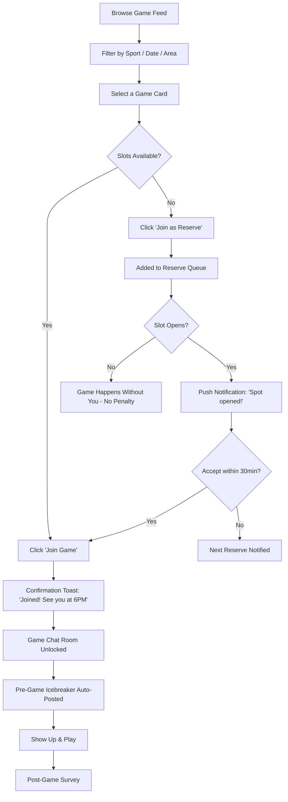
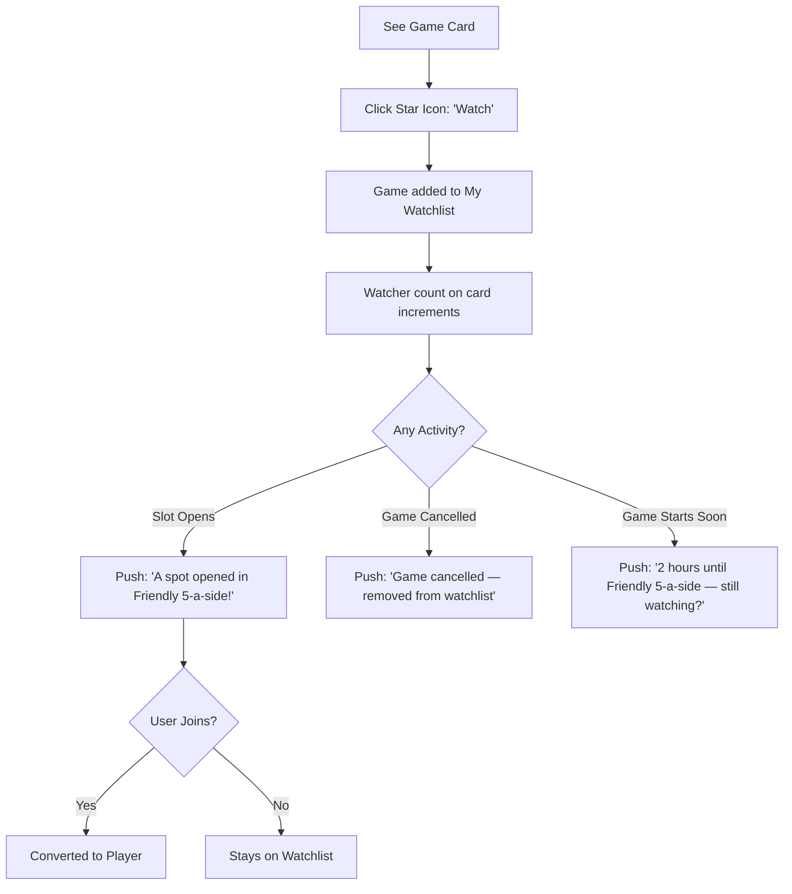
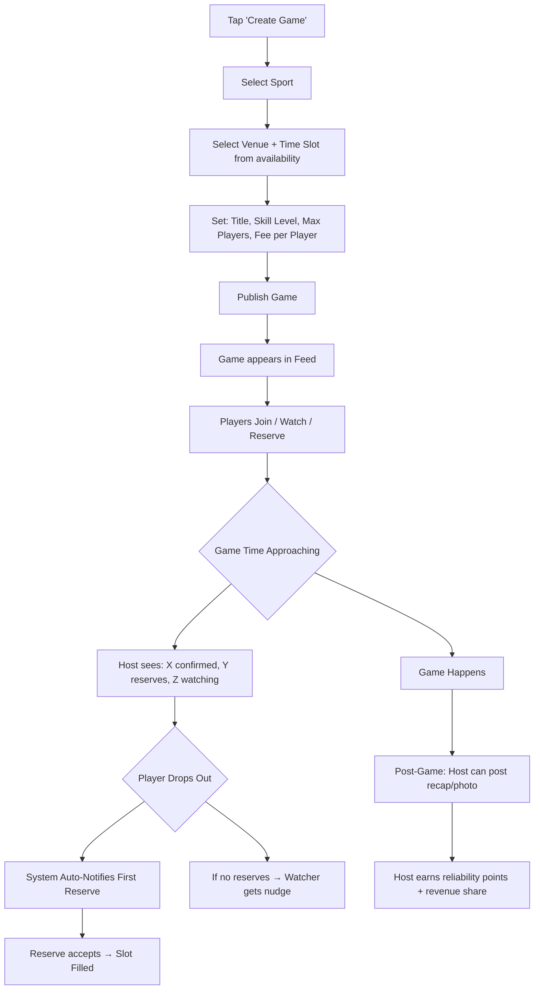
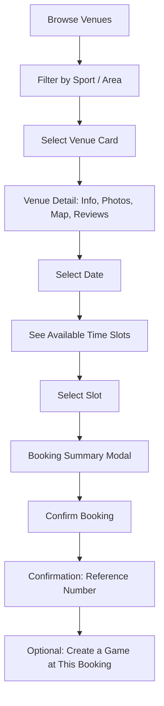
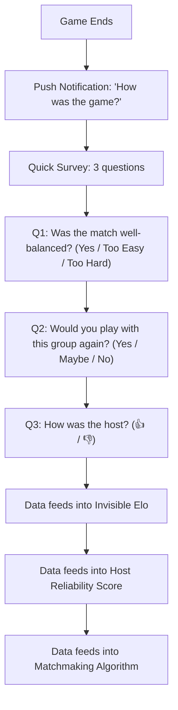

# 04 — User Flows & Journeys

## Flow 1: New User Onboarding (The Transplant Journey)

### Key Design Decisions:
- **Guest Browsing:** Users can see ALL content without signing up. The paywall is on *action* (join/watch), not on *viewing*.
- **Watch-First:** The first CTA is "Watch", not "Join". This lowers the commitment threshold.
- **Profile is Minimal:** Name + one sport + area. No lengthy onboarding questionnaire.

---

## Flow 2: Joining a Game (The Core Loop)

### Key Design Decisions:
- **No Payment at Join (MVP):** In MVP, payment is handled at the venue. In-app payments come in Tier 3.
- **30-Minute Accept Window:** Prevents reserves from ghosting after being notified.
- **No Penalty for Reserves:** Reserves who decline are not penalised — they never committed.

---

## Flow 3: Watching a Game (The Lurk Layer)

### Key Design Decisions:
- **Anonymous:** Watchers are NOT visible to other players. Only the organizer sees the count (not names).
- **Soft Nudges:** The "still watching?" notification is a gentle conversion prompt, not pressure.

---

## Flow 4: Hosting a Game (Organizer Flow)

---

## Flow 5: Venue Booking (Direct Court Booking)

### Key Design Decision:
- **Booking → Game Creation Bridge:** After booking a court, the user is prompted: *"You've booked a pitch — want to open it up as a game?"* This converts solo bookings into community games.

---

## Flow 6: Post-Game Feedback Loop

### Key Design Decisions:
- **3 questions max.** Anything more kills completion rates.
- **No individual player ratings.** You rate the *game quality* and the *host*, never a specific player. This prevents social toxicity.
- **Invisible Elo adjusts silently.** Users notice that games "feel right" over time.

---

## Journey Map: The Transplant (Maya, 29)

| Week | Action | Emotion | Platform State |
|---|---|---|---|
| 1 | Finds Pitch via Instagram ad. Browses games. | Curious but cautious. | Guest |
| 1 | Watches 3 football games. | Low commitment, feels safe. | Watcher |
| 2 | Gets notification: "Slot opened in Friendly 5-a-side!" | Excited but nervous. | Watcher |
| 2 | Joins as Sub-in. Uses game chat to say hi. | Relieved to have context. | Player |
| 2 | Attends first game. Plays OK. Host is friendly. | "That was actually fun." | Player |
| 3 | Joins the same host's game the next week without prompting. | Building routine. | Returning Player |
| 5 | Watches a Tuesday game at Avoniel she wasn't prompted about. | Habitual behaviour. | Regular |
| 8 | Creates her first game: "Ladies 5-a-side, All Levels" | Identity shift: organizer. | Host |
