# 05 — Data Schema

## Entity Relationship Diagram

```mermaid
erDiagram
    USER ||--o{ GAME_PARTICIPANT : joins
    USER ||--o{ GAME : hosts
    USER ||--o{ VENUE_BOOKING : books
    USER ||--o{ WATCHLIST : watches
    USER ||--o{ RESERVE : reserves
    USER ||--o{ FEEDBACK : gives
    USER {
        uuid id PK
        string email UK
        string password_hash
        string name
        string avatar_url
        string area
        string city
        enum auth_provider "email | google | apple"
        float reliability_score "0.0 - 1.0"
        int games_played
        int games_hosted
        float invisible_elo "hidden from user"
        enum host_tier "none | verified | trusted"
        json preferred_sports "array of sport names"
        timestamp created_at
        timestamp updated_at
    }

    VENUE ||--o{ VENUE_SLOT : has
    VENUE ||--o{ VENUE_BOOKING : receives
    VENUE ||--o{ GAME : located_at
    VENUE {
        uuid id PK
        string name
        string sport
        string area
        string city
        string address
        float latitude
        float longitude
        string google_maps_place_id
        string image_url
        float price_per_hour
        float rating
        int review_count
        json tags "array of strings"
        json amenities "array of strings"
        string contact_phone
        string contact_email
        boolean is_partner "venue has partnership with GameNI"
        timestamp created_at
    }

    VENUE_SLOT {
        uuid id PK
        uuid venue_id FK
        date date
        time start_time
        time end_time
        enum status "available | booked | blocked"
        uuid booked_by FK "nullable, references USER"
        timestamp created_at
    }

    VENUE_BOOKING {
        uuid id PK
        uuid user_id FK
        uuid venue_id FK
        uuid venue_slot_id FK
        date booking_date
        time start_time
        time end_time
        float total_price
        enum status "confirmed | cancelled | completed"
        string reference_number UK
        uuid linked_game_id FK "nullable - if booking was converted to a game"
        timestamp created_at
    }

    GAME ||--o{ GAME_PARTICIPANT : has
    GAME ||--o{ WATCHLIST : watched_by
    GAME ||--o{ RESERVE : has_reserves
    GAME ||--o{ GAME_CHAT_MESSAGE : contains
    GAME ||--o{ FEEDBACK : receives
    GAME {
        uuid id PK
        uuid host_id FK
        uuid venue_id FK
        uuid venue_slot_id FK "nullable"
        string title
        string sport
        enum skill_level "beginner | intermediate | advanced | all_levels"
        date game_date
        time game_time
        int max_players
        int current_players
        float fee_per_player
        enum status "upcoming | in_progress | completed | cancelled"
        int watcher_count
        int reserve_count
        boolean is_recurring
        uuid recurring_parent_id FK "nullable"
        string recurrence_rule "nullable, e.g. RRULE:FREQ=WEEKLY;BYDAY=TU"
        timestamp created_at
        timestamp updated_at
    }

    GAME_PARTICIPANT {
        uuid id PK
        uuid game_id FK
        uuid user_id FK
        enum status "confirmed | cancelled | no_show | attended"
        enum join_method "direct | reserve_promoted | sub_in"
        timestamp joined_at
        timestamp cancelled_at "nullable"
    }

    WATCHLIST {
        uuid id PK
        uuid user_id FK
        uuid game_id FK
        boolean notified_of_opening "has the user been pinged about a slot?"
        timestamp created_at
    }

    RESERVE {
        uuid id PK
        uuid user_id FK
        uuid game_id FK
        int queue_position
        enum status "waiting | notified | accepted | declined | expired"
        timestamp notified_at "nullable"
        timestamp responded_at "nullable"
        timestamp created_at
    }

    GAME_CHAT_MESSAGE {
        uuid id PK
        uuid game_id FK
        uuid user_id FK
        string message_text
        enum message_type "user | system | icebreaker"
        timestamp created_at
    }

    FEEDBACK {
        uuid id PK
        uuid game_id FK
        uuid user_id FK "the person giving feedback"
        enum match_balance "balanced | too_easy | too_hard"
        enum play_again "yes | maybe | no"
        enum host_rating "thumbs_up | thumbs_down"
        timestamp created_at
    }

    TRAINER ||--o{ TRAINER_BOOKING : booked_for
    TRAINER {
        uuid id PK
        uuid user_id FK "trainer is also a user"
        string sport
        string experience
        int student_count
        float rating
        float rate_per_session
        string bio
        json availability "weekly schedule"
        timestamp created_at
    }

    TRAINER_BOOKING {
        uuid id PK
        uuid trainer_id FK
        uuid student_id FK
        date session_date
        time session_time
        float price
        enum status "confirmed | cancelled | completed"
        timestamp created_at
    }

    NOTIFICATION {
        uuid id PK
        uuid user_id FK
        string title
        string body
        enum type "reserve_promoted | slot_opened | game_reminder | host_nudge | system"
        uuid reference_id "FK to game_id or booking_id"
        boolean is_read
        timestamp created_at
    }
```

---

## Key Schema Design Decisions

### 1. Invisible Elo
The `invisible_elo` field on USER is **never exposed** via any API endpoint to the client. It is used solely by the backend matchmaking service to suggest games. This is a deliberate design choice from the research: users don't want a number — they want the system to quietly match them with people they'll have a good game against.

### 2. Reliability Score
Calculated as: `games_attended / games_joined` (excluding cancellations made >24 hours in advance). This rewards consistency without punishing life. A cancellation 2 days before doesn't hurt your score. A no-show does.

### 3. Reserve Queue
Reserves are ordered by `queue_position`. When a slot opens:
1. Reserve #1 is notified (status → `notified`)
2. 30-minute timer starts
3. If accepted → status → `accepted`, GAME_PARTICIPANT created, next reserves shift up
4. If declined or expired → status → `declined`/`expired`, Reserve #2 is notified

### 4. Watchlist vs. Reserve
These are **separate concerns**:
- **Watchlist:** "I'm curious about this game." No commitment. Anonymous.
- **Reserve:** "I want to play if a slot opens." Semi-committed. Visible to the host (count only, not names until promoted).

### 5. Game Chat Lifecycle
Chat rooms are ephemeral:
- Created when the game is published
- Active until 1 hour after the game's scheduled end time
- An auto-icebreaker system message is posted when the first player joins
- Messages are soft-deleted after 7 days (privacy)

### 6. Venue Partner Flag
The `is_partner` boolean on VENUE distinguishes between:
- **Partner venues:** Real-time slot availability via API, commission-based revenue
- **Community venues:** Manually managed slots, used for public parks and informal spaces

---

## Indexes & Performance Considerations

| Table | Recommended Indexes |
|---|---|
| `GAME` | `(city, sport, game_date, status)` — primary browse query |
| `GAME` | `(host_id, status)` — host dashboard |
| `GAME_PARTICIPANT` | `(user_id, status)` — user's upcoming games |
| `VENUE` | `(city, sport)` — venue discovery |
| `VENUE_SLOT` | `(venue_id, date, status)` — slot availability |
| `WATCHLIST` | `(user_id)` — user's watchlist page |
| `RESERVE` | `(game_id, queue_position, status)` — reserve promotion logic |
| `NOTIFICATION` | `(user_id, is_read, created_at)` — notification feed |
