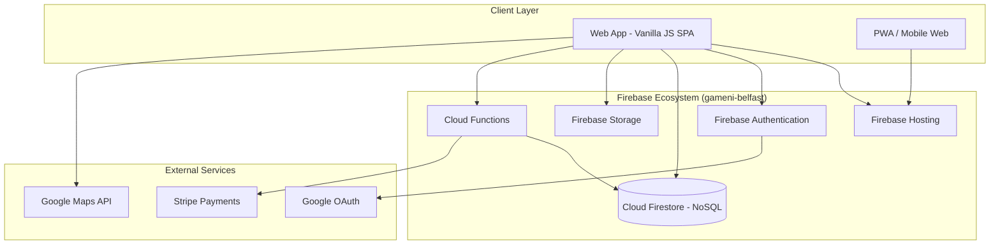

# 07 — Technical Architecture

## Architecture Overview

---

## Recommended Tech Stack

### Frontend
| Layer | Technology | Rationale |
|---|---|---|
| **Framework** | Vanilla JavaScript (ES6 Modules) | Ultra-lightweight, zero build-step overhead for rapid prototyping. |
| **Styling** | Vanilla CSS with CSS Custom Properties | Full control, "Kinetic Gallery" design system, no framework lock-in. |
| **State** | DOM / Local Variables | Simple reactive bindings attached directly to element events. |
| **Maps** | Google Maps JavaScript API | Venue locations, routing. |
| **Fonts** | Google Fonts (Lexend, Manrope) | Beautiful, readable, modern typography. |
| **Icons** | Font Awesome 6 | Comprehensive vector iconography. |

### Backend (Serverless)
| Layer | Technology | Rationale |
|---|---|---|
| **Platform** | Firebase (Project: `gameni-belfast`) | Unified, deeply integrated backend-as-a-service. |
| **Auth** | Firebase Auth | Drop-in support for Google OAuth and Email/Password with session management. |
| **Database** | Cloud Firestore | Real-time NoSQL document database, ideal for chat and live game availability. |
| **File Storage** | Firebase Cloud Storage | Secure object storage for user avatars and venue images. |
| **Compute** | Firebase Cloud Functions | Node.js serverless functions for secure background tasks (Elo calculation). |

### Infrastructure
| Layer | Technology | Rationale |
|---|---|---|
| **Hosting** | Firebase Hosting | Fast, secure, global CDN natively integrated with the Firebase CLI. |
| **CI/CD** | GitHub Actions | Automated deployment via Firebase CLI (`firebase deploy`). |

---

## Data Layer (Firestore)

Unlike a traditional REST API, the client queries Firestore directly using the Firebase JS SDK, protected by **Firestore Security Rules**.

### Core Collections

#### `users`
- Stores user profiles, display names, and invisible Elo/reliability ratings.
- **Security**: Users can read their own data; Cloud Functions handle updating the Elo rating.

#### `venues`
- Stores venue details, addresses, sports types, and amenities.
- **Security**: Publicly readable.

#### `games`
- Stores game sessions, player rosters, watchers (Lurk Layer), and reserve queues.
- **Security**: Publicly readable. Only the host can modify the core details; authenticated users can add themselves to the roster or watchlist.

#### `game_chats` (Subcollection)
- Real-time messages within a specific game document.
- **Security**: Only members on the game roster can read/write messages.

---

## Background Jobs (Cloud Functions)

Instead of traditional cron jobs/BullMQ, GameNI uses Firebase Cloud Functions and Cloud Tasks:

| Function Name | Trigger | Action |
|---|---|---|
| `onPlayerCancel` | Firestore `onUpdate` (Games) | Notifies the first reserve in queue, starts expiration timer via Cloud Tasks. |
| `expireReserve` | HTTP (via Cloud Tasks) | Marks a reserve invite as expired if not accepted within the window. |
| `gameReminder` | Cloud Scheduler (Cron) | Runs periodically to find games starting in 2 hours and sends FCM/Email reminders. |
| `processFeedback` | Firestore `onCreate` (Feedback) | Recalculates user reliability scores and Elo based on post-game balance reviews. |
| `cleanupChat` | Cloud Scheduler (Cron) | Soft-deletes or archives chat messages for games that concluded 7+ days ago. |

---

## Security Considerations

| Concern | Mitigation |
|---|---|
| **Authentication** | Firebase Auth handles secure JWT issuance and automatic token refreshing. |
| **Authorization** | Firestore Security Rules enforce role-based access directly at the database layer (e.g., `request.auth.uid == resource.data.hostId`). |
| **Invisible Elo** | The `elo` and `reliability` fields on the `users` document are protected by Security Rules. Only Cloud Functions can write to them; clients cannot read others' scores. |
| **Watchlist Privacy** | Watchers are stored as references in a subcollection or private array, with Security Rules preventing public reads of the actual identities. The UI only aggregates the count. |
| **Real-time Chat** | Native Firestore listeners (`onSnapshot`) provide instant updates without managing complex WebSockets. |
