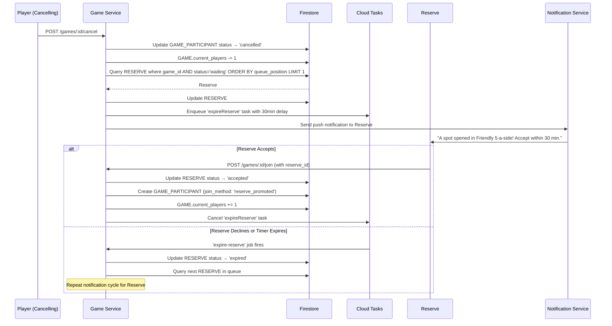
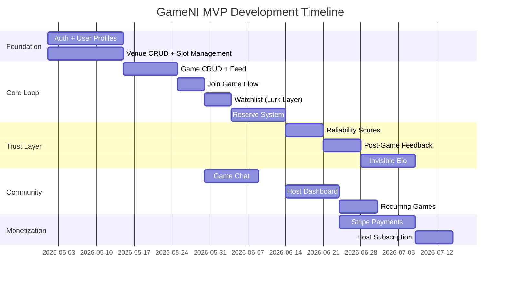

# 08 — Workflow Implementation Guide

This document provides step-by-step guidance for the engineering team to implement the core workflows. Each workflow is broken into discrete, testable tasks.

---

## Workflow 1: Reserve Promotion Pipeline

This is the most critical and complex workflow in the system. It is the engine that powers "commitment-free reliability".

### System Sequence Diagram



### Implementation Tasks

| Task | Description | Test |
|---|---|---|
| 1.1 | Add `cancel` endpoint to Game Service | Player can cancel; `current_players` decrements |
| 1.2 | Add Reserve query logic | Finds first `waiting` reserve by `queue_position` |
| 1.3 | Integrate Cloud Tasks timer for 30min window | Task fires after 30 minutes |
| 1.4 | Add notification trigger | Push notification sent to reserve's device |
| 1.5 | Add `accept` endpoint for reserves | Reserve becomes a participant; job cancelled |
| 1.6 | Add `expire` handler | Expired reserve triggers next-in-queue |
| 1.7 | Add edge case: no reserves left | Trigger watcher nudge instead |
| 1.8 | Add edge case: game is cancelled entirely | All reserves and watchers notified; all cleaned up |

---

## Workflow 2: Game Creation + Venue Booking Bridge

When a user books a court, we want to offer them the option to convert it into a community game. This is the key conversion from solo booking to community formation.

### Implementation Tasks

| Task | Description | Test |
|---|---|---|
| 2.1 | After venue booking confirmation, show CTA: "Open this as a game?" | CTA renders in confirmation modal |
| 2.2 | If user clicks yes, pre-fill game creation form with venue, date, time | Form is pre-populated correctly |
| 2.3 | User sets: title, sport, skill level, max players, fee | Game is created with all fields |
| 2.4 | Link `VENUE_BOOKING.linked_game_id` to the new `GAME.id` | Booking and game are linked in DB |
| 2.5 | Game appears in the public feed immediately | Visible to other users |
| 2.6 | If the booking is cancelled, auto-cancel the linked game and notify all participants | Cascading cleanup |

---

## Workflow 3: Post-Game Feedback → Invisible Elo

### Algorithm Outline

```python
# Pseudocode for Elo adjustment after a game

def process_feedback(game_id):
    feedbacks = get_all_feedback(game_id)
    participants = get_all_participants(game_id)
    
    # Calculate balance consensus
    balance_votes = [f.match_balance for f in feedbacks]
    balanced_pct = count(balance_votes, 'balanced') / len(balance_votes)
    
    for participant in participants:
        current_elo = participant.invisible_elo
        
        if balanced_pct > 0.7:
            # Game was well-matched — small adjustment toward group mean
            group_mean_elo = average([p.invisible_elo for p in participants])
            adjustment = (group_mean_elo - current_elo) * 0.05
        elif 'too_easy' in balance_votes:
            # Some players found it too easy — they might be underrated
            if participant voted 'too_easy':
                adjustment = +15  # Bump them up
            elif participant voted 'too_hard':
                adjustment = -10  # They might be overrated
        else:
            adjustment = 0
        
        participant.invisible_elo += adjustment
        save(participant)
```

### Implementation Tasks

| Task | Description | Test |
|---|---|---|
| 3.1 | Create feedback submission endpoint | Accepts 3-question survey |
| 3.2 | Enqueue `update-elo` job on feedback submission | Job is created |
| 3.3 | Implement Elo adjustment algorithm | Elo values change correctly |
| 3.4 | Ensure Elo is NEVER returned in any API response | `invisible_elo` is excluded from all serializers |
| 3.5 | Build matchmaking query: suggest games where average player Elo is within ±100 of user's Elo | Recommendations are relevant |

---

## Workflow 4: Reliability Score Calculation

### Formula
```
reliability_score = attended_games / (attended_games + no_shows)
```

**Rules:**
- Cancellations made **>24 hours before** the game are excluded entirely (not counted as attended or no-show)
- Cancellations made **<24 hours before** count as a no-show UNLESS a reserve fills the slot (in which case, no penalty)
- Attendance is confirmed by the host post-game OR by submitting the post-game survey

### Implementation Tasks

| Task | Description |
|---|---|
| 4.1 | After each game, host marks attendance (confirm/no-show for each player) |
| 4.2 | Alternative: if player submits post-game survey, auto-mark as attended |
| 4.3 | Recalculate `reliability_score` on USER after every game |
| 4.4 | Display reliability score on user profile (e.g., "Shows Up: 95%") |
| 4.5 | Organizers can see reliability scores of players who want to join |

---

## Workflow 5: Recurring Games

### Logic
When a Host creates a recurring game:
1. Create a `GAME` record with `is_recurring = true` and a `recurrence_rule` (e.g., `RRULE:FREQ=WEEKLY;BYDAY=TU`)
2. This is the "parent" game
3. Every Sunday at midnight, a scheduled job creates the next week's child game instances
4. Child games have `recurring_parent_id` set to the parent's ID
5. "Regulars" (users who have attended 3+ sessions of this recurring game) are auto-invited to the next instance

### Implementation Tasks

| Task | Description |
|---|---|
| 5.1 | Add `is_recurring` and `recurrence_rule` fields to GAME |
| 5.2 | Build weekly cron job to spawn child game instances |
| 5.3 | Auto-invite regulars (3+ past attendances) to the new instance |
| 5.4 | Allow host to edit/cancel individual instances without affecting the series |

---

## Workflow 6: Chat Room Lifecycle

| Event | Action |
|---|---|
| Game is published | Chat room is created (empty) |
| First player joins | System posts icebreaker: "👋 Welcome! Share what you're wearing so you can find each other." |
| Each new player joins | System posts: "[Name] has joined the game" |
| 2 hours before game | System posts: "Game starts in 2 hours! See you at [venue]" |
| Player cancels | System posts: "[Name] has left the game. Reserves are being notified." |
| 1 hour after game ends | Chat room is locked (read-only) |
| 7 days after game | All messages are soft-deleted |

---

## Development Sequence Recommendation

The recommended build order based on dependencies and user impact:


